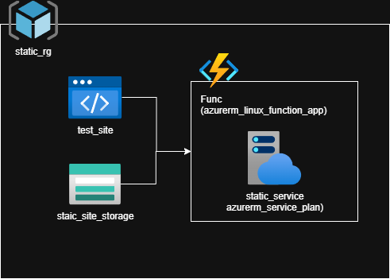
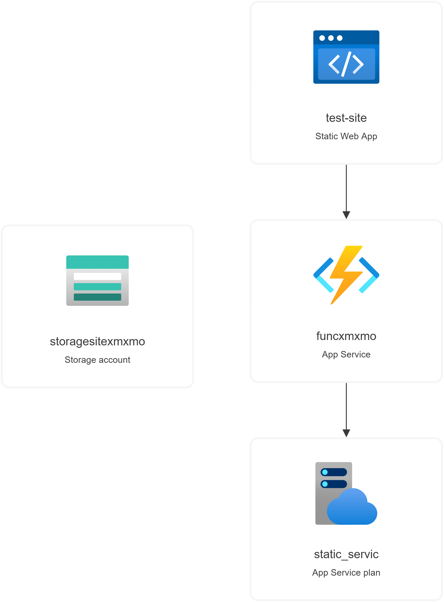

# Azure Static Web App CI/CD Project

## Overview

This project demonstrates how to provision a complete Azure infrastructure for hosting a static website with serverless backend using Azure Static Web Apps and Azure Functions, all managed via Terraform. The setup is designed to support CI/CD workflows, enabling automated deployments of static sites and their associated Azure resources.

## Architecture



The infrastructure consists of the following Azure resources:

- **Resource Group (`static_rg`)**: Logical container for all resources.
- **Storage Account (`storagesitexxxxx`)**: Used for Azure Function App storage.
- **App Service Plan (`static_servic`)**: Linux-based plan for hosting the Azure Function App.
- **Azure Linux Function App (`funcxxxxx`)**: Serverless backend for APIs or background jobs.
- **Azure Static Web App (`test-site`)**: Hosts the static website and integrates with the Function App for API routes.

Below is a visual representation of the deployed resources and their relationships:



## Features

- **Infrastructure as Code**: All resources are defined in Terraform for repeatable, version-controlled deployments.
- **Globally Unique Naming**: Uses random strings to ensure unique resource names.
- **Best Practices**: Follows Azure best practices for resource provisioning and integration.
- **CI/CD Ready**: Designed to integrate with GitHub Actions or Azure DevOps for automated deployments.

## How to Set Up CI/CD for Static Websites

1. **Clone this Repository**
   ```sh
   git clone <your-repo-url>
   cd azure-static-web-app-CICD

2. **Run Terraform commands**:
    ```sh
    terraform init
    terraform plan
    terraform apply
    ```